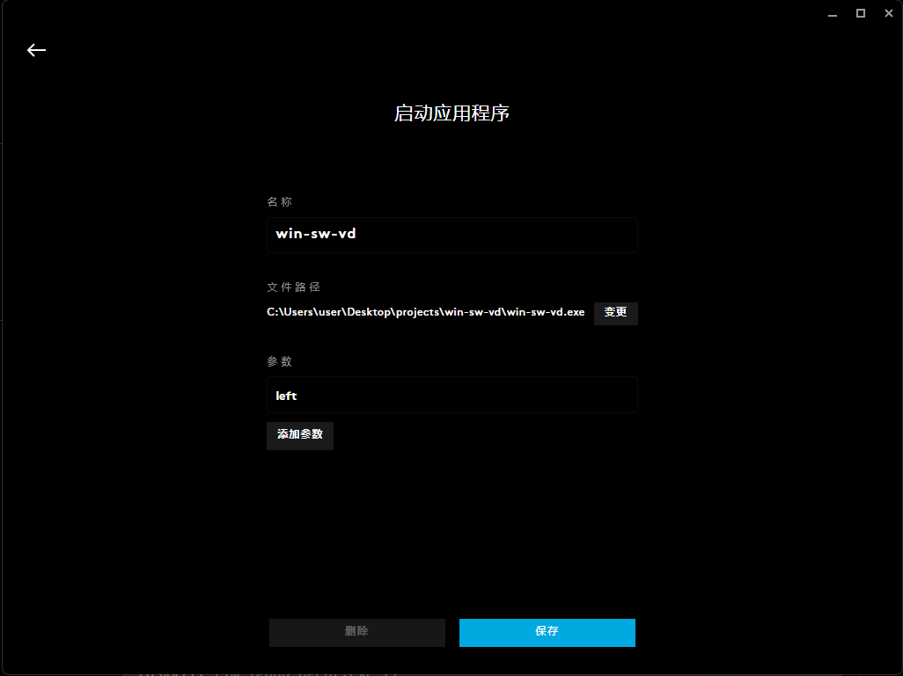

# win-sw-vd
Windows Switch between Virtual Desktops

## usage

```shell
win-sw-vd.exe left
win-sw-vd.exe right
```

or simply run without arguments for demo

```shell
win-sw-vd.exe
```

## Why I need this
If you are using Microsoft remote desktop (mstsc.exe) and want to switch between host virtual desktops, you would get however switching inside guest Windows. So I made this tool and you can bind it to special keyboard or mouse keys. For example I bind this program to my Logitech mouse in its G Hub software and everything works great.


